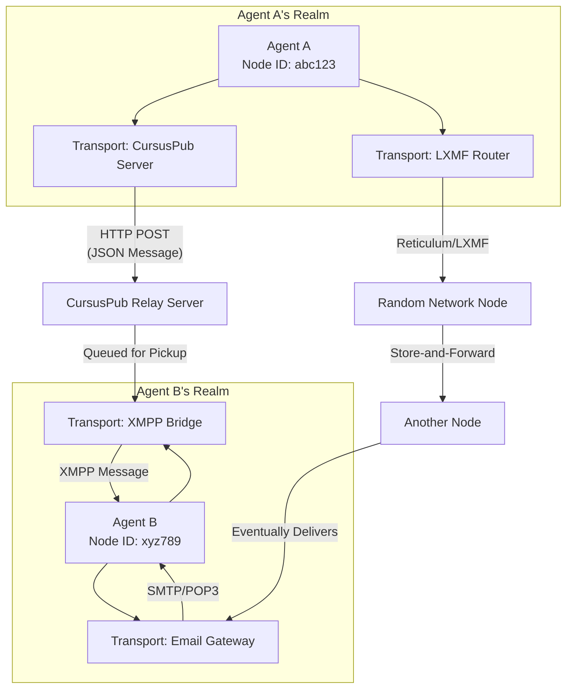

# CursusPub Protocol

## The Asynchronous Agent Protocol for a Disconnected World

**CursusPub** is an open protocol and reference implementation for building resilient, asynchronous, and transport-agnostic communication between autonomous agents (A2A) and services. In an era of walled gardens, corporate clouds, and intermittent connectivity, CursusPub provides the digital infrastructure for independent, peer-to-peer interaction.

### The Problem: The Tyranny of the Centralized & Synchronous
Modern service interaction is built on paradigms like REST and SOAP that assume immediate, synchronous responses, stable network addresses, and centralized infrastructure. This breaks down in real-world scenarios: mobile devices with gray addresses, intermittent network links, or the simple desire for digital autonomy without reliance on third-party platforms.

### Our Solution: The Modern *Cursus Publicus*
Inspired by the *Cursus Publicus*—the standardized courier network of the Roman Empire—our protocol provides a reliable "public way" for messages. It is designed from the ground up for **asynchronous, peer-to-peer communication** that works over **any transport layer**.

A message finds its path from one agent to another not via a single central hub, but by navigating a landscape of available transport gateways, much like the ancient courier system used a network of relay stations.

## Core Philosophy & Key Features

    Agent-Centric & Peer-to-Peer: Every participant is a Node—an autonomous agent identified by its Ed25519 public key hash. There are no privileged "clients" or "servers," only nodes with different capabilities.

    Transport-Agnostic: The protocol logic is completely separate from the transport layer. Send messages via HTTPS today, LXMF or XMPP tomorrow, or even email or custom radio protocols. The first reference transport is a simple PHP relay server.

    Asynchronous by Design: No expectation of immediate response. Messages are composed, signed, and sent into the network. They are delivered when the recipient's transport becomes available.

    Cryptographically Secure: Every node is identified by its Ed25519 key pair. All messages are signed, ensuring authenticity and integrity. Future extensions will include end-to-end encryption.

    Resilient and Simple: Designed to work in low-connectivity, "gray address" environments (like behind NAT, on mobile data). The core specification is minimal, enabling robust implementations even on constrained devices.

## Project Status & Roadmap

## CursusPub is in its early architectural phase.

    Phase 0 (Current): Finalize core protocol specification (v0.1).

    Phase 1: Release the reference CursusPub Relay Server (PHP/SQLite) and a basic CLI agent.

    Phase 2: Develop adapters for popular transports (XMPP, LXMF/Reticulum, SMTP).

    Phase 3: Build tools for node discovery (DHT-based or via public registries) and higher-level abstractions (e.g., REST-like adapter for legacy services).

## Get Involved

This is an open-source, community-driven project. We are looking for developers, protocol designers, and enthusiasts who believe in a more decentralized and resilient fabric for software interaction.

    Explore the draft specification in the /spec directory.

    Contribute ideas to the discussion in our Issues.

    Help us build the reference implementation.

Let's build the public way for software agents.

# Протокол CursusPub
Асинхронный протокол для взаимодействия агентов в разъединенном мире

CursusPub — это открытый протокол и эталонная реализация для создания устойчивой, асинхронной и независимой от транспорта связи между автономными агентами (A2A) и сервисами. В эпоху "закрытых садов", корпоративных облаков и нестабильного соединения CursusPub предоставляет цифровую инфраструктуру для независимого однорангового взаимодействия.
Проблема: Тирания централизации и синхронности

Современное взаимодействие сервисов построено на парадигмах вроде REST и SOAP, которые предполагают мгновенные синхронные ответы, статичные сетевые адреса и централизованную инфраструктуру. Это не работает в реальных условиях: мобильные устройства с "серыми" адресами, нестабильные каналы связи или простое желание цифрового суверенитета без зависимости от сторонних платформ.
Наше решение: Современный Cursus Publicus

Вдохновленный Cursus Publicus — стандартизированной курьерской сетью Римской империи — наш протокол предоставляет надежный "публичный путь" для сообщений. Он создан для асинхронной одноранговой (P2P) связи, работающей поверх любого транспортного уровня.

Сообщение находит путь от одного агента к другому не через единый центральный узел, а путем навигации по ландшафту доступных транспортных шлюзов, подобно тому как древняя курьерская система использовала сеть relay-станций.
Основная философия и ключевые особенности

    Агент-центричность и P2P: Каждый участник — это Узел (Node), автономный агент, идентифицируемый хэшом своего открытого ключа Ed25519. Нет привилегированных "клиентов" или "серверов", есть только узлы с разными возможностями.

    Независимость от транспорта: Логика протокола полностью отделена от транспортного уровня. Отправляйте сообщения через HTTPS сегодня, через LXMF или XMPP завтра, или даже по email или через радиопротоколы. Первый эталонный транспорт — простой PHP-сервер ретрансляции.

    Асинхронность по замыслу: Нет ожидания мгновенного ответа. Сообщения создаются, подписываются и отправляются в сеть. Они доставляются, когда становится доступен транспорт получателя.

    Криптографическая безопасность: Каждый узел идентифицируется своей парой ключей Ed25519. Все сообщения подписаны, что обеспечивает аутентичность и целостность. Будущие расширения добавят сквозное шифрование.

    Устойчивость и простота: Проектировался для работы в условиях слабого соединения и "серой" адресации (за NAT, на мобильном интернете). Базовая спецификация минималистична, что позволяет создавать надежные реализации даже на ограниченных устройствах.

## Статус проекта и план развития

CursusPub находится на ранней архитектурной стадии.

    Фаза 0 (Текущая): Завершить работу над базовой спецификацией протокола (v0.1).

    Фаза 1: Выпустить эталонный CursusPub Relay Server (PHP/SQLite) и базовый CLI-агент.

    Фаза 2: Разработать адаптеры для популярных транспортов (XMPP, LXMF/Reticulum, SMTP).

    Фаза 3: Создать инструменты для обнаружения узлов (на основе DHT или публичных реестров) и высокоуровневые абстракции (например, REST-подобный адаптер для legacy-сервисов).

## Присоединяйтесь

Это проект с открытым исходным кодом, движимый сообществом. Мы ищем разработчиков, проектировщиков протоколов и энтузиастов, которые верят в более децентрализованную и устойчивую основу для взаимодействия программ.

    Изучите черновую спецификацию в директории /spec.

    Предлагайте идеи в обсуждениях (Issues).

    Помогите нам построить эталонную реализацию.

Давайте построим независимый транспорт для программных агентов.
